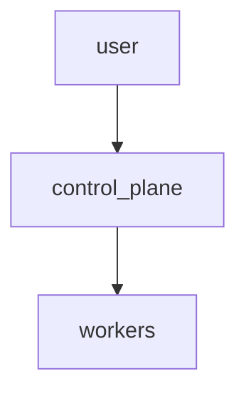

# Kubernetes Cluster with Ansible


This project deploys a multi-node Kubernetes cluster using Ansible and includes an optional Flask UI.

## Requirements

- At least 2 vCPU and 4GB RAM per node
- Python 3.12
- Ansible >= 2.17

## Quick start

```bash
pip install -r requirements.txt  # ansible, ansible-lint, etc.
python generate_inventory.py
ansible-playbook -i ansible/inventory.ini ansible/site.yml --check
```

1. Edit ansible/config.yml with your IP addresses.
2. Run `python generate_inventory.py` to create inventory.ini.
3. Execute `ansible-playbook -i ansible/inventory.ini ansible/site.yml`.

## Configuration

Edit `ansible/config.yml` to specify your nodes:

```yaml
cluster_name: demo-cluster
ssh_user: ubuntu
private_key_path: ~/.ssh/id_rsa
control_plane:
  - 192.168.56.10
workers:
  - 192.168.56.11
  - 192.168.56.12
```

## GUI

Run `make ui` and open `http://localhost:5000` to edit the configuration and deploy.

## CLI

Use `make deploy` to generate the inventory and run the playbook.

## Update and Upgrade

To upgrade Kubernetes:

```bash
ansible-playbook -i ansible/inventory.ini ansible/upgrade.yml
```

## Documentation

Mermaid diagram of the topology:



A detailed PlantUML diagram is available in `docs/architecture.puml`.

## Troubleshooting

See the FAQ in `docs/` for common issues.
