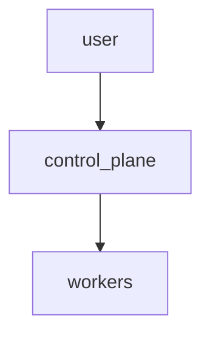

# Kubernetes Cluster with Ansible


This project deploys a multi-node Kubernetes cluster using Ansible but is fully managed from a web UI. All configuration is stored in SQLite.

## Requirements

- At least 2 vCPU and 4GB RAM per node
- Python 3.12
- Ansible >= 2.17

## Quick start

```bash
./bootstrap.sh
# The UI will open at http://localhost:5000
```

The screenshot below can be regenerated by opening the web interface and
capturing the page as `docs/ui.png`.


## Configuration

All cluster settings are entered through the web interface. Click **New Cluster** and fill in the form. Advanced parameters such as Kubernetes version and CNI plugin are hidden inside an *Advanced* section.

## GUI

Run `make up` and open `http://localhost:5000` to manage your cluster without touching YAML. If you need a sample configuration for tests or CI, run `make example-db` which generates `database/example.db`.

## CLI

Traditional CLI usage is documented in `docs/CLI.md` for reference only. The recommended workflow is entirely through the web interface.

 
## Update and Upgrade

To upgrade Kubernetes:

```bash
ansible-playbook -i ansible/inventory.ini ansible/upgrade.yml
```

## Documentation

Mermaid diagram of the topology:



A detailed PlantUML diagram is available in `docs/architecture.puml`.

## Troubleshooting

See the FAQ in `docs/` for common issues.
